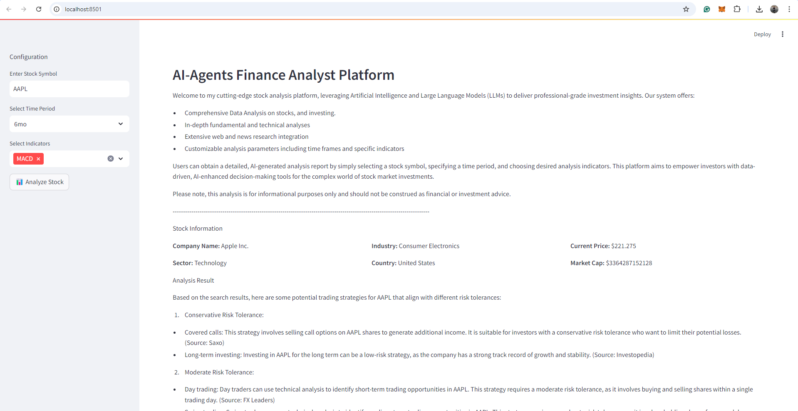
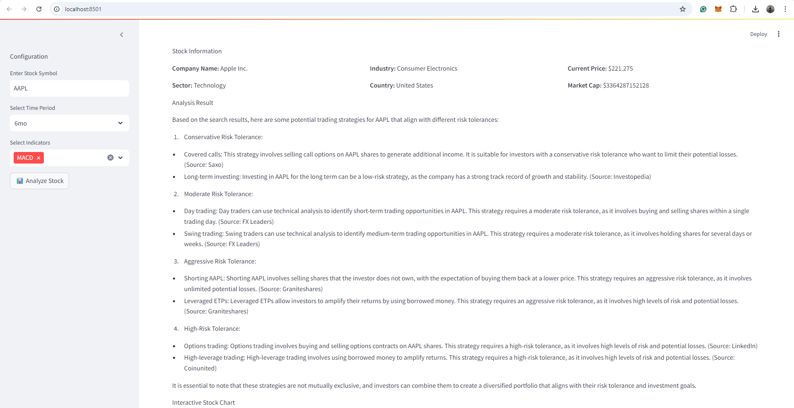
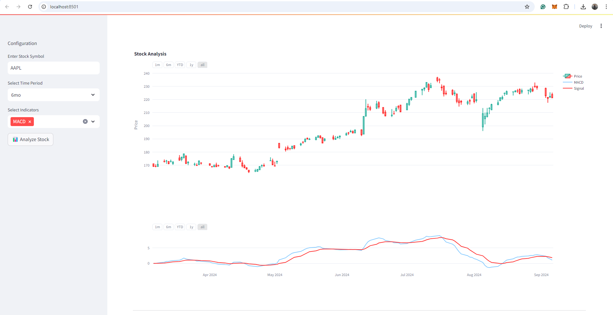

<h1 align="center">Multi Agent Collaboration for Financial Analysis</h1>


Multi-agent collaboration in financial analysis is like assembling a team of financial detectives, each with their own specialized skills, working together to crack the case. These agents—powered by large language models (LLMs)—combine forces to tackle complex financial problems. Picture it as a high-stakes brainstorming session where everyone brings their A-game.


<strong>The AgentUniverse Framework:</strong>
- It’s like the backstage crew ensuring that our financial agents hit all the right notes.
- What It Does: AgentUniverse provides a flexible and extensible platform for building individual agents. These agents can be LLM-based, meaning they leverage the power of language models (think GPT-4 or its future cousins).
- Collaboration Mode Components: Here’s where the magic happens. AgentUniverse features a set of multi-agent collaboration mode components. Imagine these as different choreography styles for our financial dancers. Each component specializes in solving specific types of problems.
- <strong>PEER Mode Component:</strong> This one’s like a synchronized routine. Agents take on different roles—Plan, Execute, Express, and Review. They break down complex problems, execute steps in sequence, and iteratively improve based on feedback. Think of it as a financial interpretive dance.
- <strong>DOE Mode Component:</strong> Data-fining, Opinion-inject, and Express—these agents form a trio. They tackle data-intensive tasks, maintain computational precision, and incorporate expert opinions. It’s like a financial jazz ensemble.

<strong>In Summary:</strong>
Multi-agent collaboration for financial analysis is like a symphony where LLM-powered agents harmonize, riff off each other, and create beautiful financial melodies. 

So, whether you’re decoding market signals, predicting trends, or optimizing portfolios, remember: Behind the scenes, our financial agents are waltzing, cha-cha-ing, and occasionally doing the moonwalk—all for better insights! 

<p align="center">
  
</p> 

### Steps to run streamlit application:

```sh 
$ git clone https://github.com/IntelegixLabs/Multi_Agent_Collaboration_for_Financial_Analysis.git
$ cd Multi_Agent_Collaboration_for_Financial_Analysis
$ pip install -r requirements.txt
$ streamlit run streamlit_app\app.py
```

### Steps to run Flask application:

```sh 
$ git clone https://github.com/IntelegixLabs/Multi_Agent_Collaboration_for_Financial_Analysis.git
$ cd Multi_Agent_Collaboration_for_Financial_Analysis
$ pip install -r requirements.txt
$ python template_for_api_marketplace.py
```

## Application Screenshots / <a href="">Demo.</a>

<p align="center">
  
  
  
</p>
